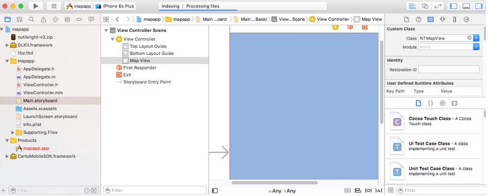

## Getting Started

The following workflow guides you through the process of getting started with the Mobile SDK.

#### Prerequisites

You must have account access to develop location apps with CARTO Engine.

- View our [pricing page](https://carto.com/pricing/) for details about which accounts include the Mobile SDK

- Access to Mobile SDK features are managed by CARTO. If you cannot reproduce any of the steps in this Getting Started section, [contact us](mailto:sales@carto.com) to ensure that you have account access, and that the Mobile SDK features are enabled for your account

### Downloading the SDK

To begin using the Mobile SDK, download the required SDK packages and libraries based on your mobile platform. [Contact us](mailto:support@carto.com) if you have questions about Mobile SDK packages and what features are included.

There are multiple ways to download SDK packages:

- Use the Managed library package based on your platform - this is the **suggested method** for managing SDK features, and also contains some default style files

- Download specific versions of SDK packages as zip files, and add them to you projects

#### Managed Libraries

These SDK libraries are managed by CARTO and include all the required libraries to support the Mobile SDK. In some cases, managed libraries are not available and the direct download package url is provided.

  <ul class="Tabs">
    <li class="Tab js-Tabpanes-navItem is-active">
      <a href="#/0" class="js-Tabpanes-navLink">Android</a>
    </li>
    <li class="Tab js-Tabpanes-navItem">
      <a href="#/1" class="js-Tabpanes-navLink">iOS</a>
    </li>
    <li class="Tab js-Tabpanes-navItem">
      <a href="#/2" class="js-Tabpanes-navLink">Xamarin</a>
    </li>
    <li class="Tab js-Tabpanes-navItem">
      <a href="#/3" class="js-Tabpanes-navLink">Windows Phone 10</a>
    </li>
  </ul>

  

    

    // Add to your build.gradle file:
    
    dependencies {
        compile 'com.carto:carto-mobile-sdk:4.1.2@aar'
    }

    
  

  

    

    // Add to your CocoaPods Podfile:

    pod 'CartoMobileSDK', '4.1.2'

    
  

  

    

    // Download CartoMobileSDK.Android or CartoMobileSDK.iOS nuget for the Xamarin SDK package

    url for Android: "https://www.nuget.org/packages/CartoMobileSDK.Android/"
    url for iOS: "https://www.nuget.org/packages/CartoMobileSDK.iOS/"

    
  

  

    

    Use NuGet package manager in Visual Studio:
    Search for "CartoMobileSDK.UWP" or use url: "https://www.nuget.org/packages/CartoMobileSDK.UWP"

    
  

#### Download SDK manually

If you do not want to use package manager, you can download SDK from the [Github mobile-sdk project releases page](https://github.com/CartoDB/mobile-sdk/releases)

### Registering your App

You must register your mobile applications under your CARTO.com account settings. Once an app is added, you can retrieve the mobile app license key, which is needed for your app code.

You can find detailed instructions on [API Keys page](/docs/carto-engine/mobile-sdk/API-keys/)

### Creating your Project

Once your mobile apps are registered and you have your API Keys, it is recommended to familiarize yourself with the setup for the platform that you are using.
Some of these platforms contain unique map features that are only available based on the mobile platform. You can then use sample mobile apps and add basic and advanced map features.

The following platform-specific instructions allow you to create your first working 
mapping app using the Mobile SDK.

#### Android Implementation

If using Android as the mobile platform, follow this implementation procedure.

1) Add the following to the `build.gradle` of your project:

  
  dependencies {
      compile 'com.carto:carto-mobile-sdk:4.1.2@aar'
  }
  
 
2) Define **INTERNET** permission for your AndroidManifest.xml

  
  <uses-permission android:name="android.permission.INTERNET"/>
  

3) Define your application layout

  Define **main layout** as **res/layout/main.xml**, so that it contains `com.carto.ui.MapView` element:

  
  <?xml version="1.0" encoding="utf-8"?>
  <LinearLayout xmlns:android="http://schemas.android.com/apk/res/android"
      xmlns:tools="http://schemas.android.com/tools"
      android:layout_width="fill_parent"
      android:layout_height="fill_parent"
      android:orientation="vertical" >
     <com.carto.ui.MapView
      android:id="@+id/mapView"
      android:layout_width="fill_parent" 
      android:layout_height="fill_parent" 
      />
  </LinearLayout>
  

4) Find the MapView object and add a base layer

  Define the MapView type in your main activity class and load layout. 
  This enables you to load the MapView from the layout. _The object itself was already created during the layout creation process, this step is specific to finding and referencing the MapView object in your request._

##### Java

  
  public class MainActivity extends Activity {
      final String LICENSE = "YOUR_LICENSE_KEY";

      private MapView mapView;

      @Override
      public void onCreate(Bundle savedInstanceState) {
          super.onCreate(savedInstanceState);
          setContentView(R.layout.main);

          // Register the license so that CARTO online services can be used
          MapView.registerLicense(LICENSE);

          // Get 'mapView' object from the application layout
          mapView = (MapView) this.findViewById(R.id.mapView);

          // Add basemap layer to mapView
          CartoOnlineVectorTileLayer baseLayer = new CartoOnlineVectorTileLayer(CartoBaseMapStyle.CARTO_BASEMAP_STYLE_VOYAGER);
          mapView.getLayers().add(baseLayer);
      }
  }
  

##### Kotlin

  
  class MainActivity : AppCompatActivity() {
      val LICENSE = "YOUR_LICENSE_KEY"

      var mapView: MapView? = null

      override fun onCreate(savedInstanceState: Bundle?) {
          super.onCreate(savedInstanceState)
          setContentView(R.layout.main);

          // Register the license so that CARTO online services can be used
          MapView.registerLicense(LICENSE, this)

          // Get 'mapView' object from the application layout
          mapView = findViewById(R.id.mapView) as MapView

          // Add basemap layer to mapView
          val layer = CartoOnlineVectorTileLayer(CartoBaseMapStyle.CARTO_BASEMAP_STYLE_VOYAGER)
          mapView?.layers?.add(layer)
      }
  }
  

5) Run the Android app

  The map should appear with the default world map provided by OpenStreetMap, as defined in your Activity. You can zoom, rotate, and tilt with these default settings.

#### iOS Implementation

If using iOS as the mobile platform, follow this implementation procedure.

1) Create new project in Xcode and add Mobile SDK framework using Podfile

  -  Create a new ‘Single View application’ in your Xcode project

  -  Get current version of CARTO Mobile SDK using CocoaPod: 

  

  // Add to your CocoaPods Podfile:

  pod 'CartoMobileSDK', '4.1.2'

  

2)  Modify Controller for Map View

  - Extend ViewController and add MapView manipulation code into it. _Ensure it is Objective C++, not plain Objective C class_

  - Rename `ViewController.m` (comes with template) to `ViewController.mm`, to avoid compilation issues

  - Implement **ViewController.h** to extend **GLKViewController**, instead of
    UIViewController

  - You must replace `YOUR_LICENSE_KEY` with your [Mobile Apps and API Key](#registering-your-app) in the code below

  
  #import  <GLKit/GLKit.h>

  @interface ViewController : GLKViewController

  @end

  #import "ViewController.h"
  #import <CartoMobileSDK/CartoMobileSDK.h>

  @implementation ViewController

  - (void)loadView {
    // 1. The initial step: register your license. 
    // **Note:** This must be done before using MapView
    [NTMapView registerLicense:@"YOUR_LICENSE_KEY"];
    [super loadView];
  }

  - (void)viewDidLoad
  {
    [super viewDidLoad];

    // 1. Ensure the storyboard has NTMapView connected as a view
    NTMapView* mapView = (NTMapView*) self.view;

    // 2. Create online vector tile layer, use style asset embedded in the project
    NTVectorTileLayer* baseLayer = [[NTCartoOnlineVectorTileLayer alloc] initWithStyle: NT_CARTO_BASEMAP_STYLE_VOYAGER];

    // 3. Add vector tile layer
    [[mapView getLayers] add:baseLayer];
  }

  @end
  

3) Modify storyboard to enable Map View

  _The default storyboard template uses UIView class, you must use NTMapView instead._

  **Note:** If you are using iPhone (**Main\_iPhone.storyboard**) or iPad (**Main\_iPad.storyboard**) files for iOS, you must repeat this step to change the default storyboard.

  -  Open Main.Storyboard, select *View Controller Scene -&gt; View Controller* -&gt; *View*

  - From Navigator window, select **Identity Inspector**, change the first parameter (Custom Class) to **NTMapView** (from the default UIView).

  

4) Run the iOS app

  The map should appear with the default world map provided by OpenStreetMap, as defined in your ViewController. You can zoom, rotate, and tilt with these default settings.

#### Xamarin (Android and iOS) Implementation

If using Xamarin as the mobile platform, follow these implementation procedures for Xamarin (Android) and Xamarin (iOS).

1. Add library as [nuget CartoMobileSDK.iOS](https://www.nuget.org/packages/CartoMobileSDK.iOS) and/or [nuget CartoMobileSDK.Android](https://www.nuget.org/packages/CartoMobileSDK.Android) from the main repo to your mobile app. 

2. [Register your mobile app](#registering-your-app) to get the API Key

    **Note:** If you are using both Xamarin Android and iOS, register each platform as its own app.

3. Create a cross-platform project for your apps

    Each platform still needs to be registered as its own app, since many app aspects (such as UI, file system, and so on) are platform-specific. However, when executing API requests with the Mobile SDK, you can create one Xamarin project for Android and iOS and share the code. _Some exceptions apply in regards to API calls which need Android context, or file system references._ For example, the following API requests are platform specific:

    - Register license key: `MapView.RegisterLicense()`
    - Create package manager: `new CartoPackageManager()`

    Almost all of the map related API code (such as adding layers and objects to map, handling interactions and clicks, etc.) can be shared for iOS and Android through one project!

The following sections describe the individual platform setup requirements for Xamarin options.

##### Xamarin Forms Apps

Xamarin Forms (version 3.3.0 and higher) support *Native Controls*. If you add Mobile SDK apps for iOS and Android platforms, Xamarin Native Controls is available by default. See the blog [_Embedding Native Controls into Xamarin.Forms_](https://blog.xamarin.com/embedding-native-controls-into-xamarin-forms) for details. 

While you can share most of code using Native Controls, you just need to specify the platform when creating the project:

<pre class="brush: csharp">
#if __IOS__
  // 1. iOS specific code
  var mapView = new Carto.Ui.MapView();
  mapView.Frame = new CGRect(20, 20, 280, 80);
  stack.Children.Add(mapView);
#endif
  // 2. Indicate the common code from both platforms
  var baseLayer = new Carto.Layers.CartoOnlineVectorTileLayer(CartoBaseMapStyle.CartoBasemapStyleVoyager);
  mapView.Layers.Add(baseLayer);
</pre>

**Note:** Native Controls only work if you create or update `Form` in the code, using the xml definition will not work. This Xamrin development requirement is subject to change with each release. _Mobile SDK with Xamarin Forms is currently in being tested with Native apps._ Please [contact us](mailto:support@carto.com) if you have an issues.

##### Xamarin Android App

Follow these steps to add native apps to your Xamarin Android package.

1) Add the nuget package [CartoMobileSDK.Android](https://www.nuget.org/packages/CartoMobileSDK.Android) to your mobile app project

2) Add MapView to your application main layout

   
  <LinearLayout xmlns:android="http://schemas.android.com/apk/res/android"
      android:layout_width="fill_parent"
      android:layout_height="fill_parent"
      android:orientation="vertical" >
     <carto.ui.MapView
      android:id="@+id/mapView"
      android:layout_width="fill_parent" 
      android:layout_height="fill_parent" 
      />
  </LinearLayout>
  

3) Create MapView object, add a base layer

  Load layout from a xml, and load the MapView from Layout. Or, create it with code. A definition of a base layer is enough for minimal map configuration.

  
  using Carto.Ui;
  using Carto.Layers;
  using Carto.DataSources;

  [Activity (Label = "Carto.HelloMap", MainLauncher = true)]
  public class MainActivity : Activity
  {
      protected override void OnCreate(Bundle bundle)
      {
          base.OnCreate(bundle);

          // 1. Register license BEFORE creating MapView (done in SetContentView)
          MapView.registerLicense("YOUR_LICENSE_KEY", this);

          /// 2. Set our view from the "main" layout resource
          SetContentView(Resource.Layout.Main);
        
          /// 3. Get our map from the layout resource 
          var mapView = FindViewById<MapView>(Resource.Id.mapView);

          /// 4. Online vector base layer
          var baseLayer = new CartoOnlineVectorTileLayer(CartoBaseMapStyle.CartoBasemapStyleVoyager);

          /// 5. Set online base layer  
          mapView.Layers.Add(baseLayer);
      }
  }
  

##### Xamarin iOS App

Follow these steps to add apps to your Xamarin iOS package.

1) Add the nuget package [CartoMobileSDK.iOS](https://www.nuget.org/packages/CartoMobileSDK.iOS) to your mobile app project

2) **Add Map object to app view**. When using Storyboards, use *OpenGL ES View Controller* (GLKit.GLKViewController) as a template for the map and replace *GLKView* with *MapView* as the underlying view class.
In the example below, it is assumed that the outlet name of the map view is *Map*.

3) **Initiate map, set base layer**

Add into MainViewController.cs:

  
  using Carto.Ui;
  using Carto.Layers;
  using Carto.DataSources;

  public class MainViewController : GLKit.GLKViewController
  {
      public override void ViewDidLoad ()
      {
          base.ViewDidLoad();

          // GLKViewController-specific parameters for smoother animations
          ResumeOnDidBecomeActive = false;
          PreferredFramesPerSecond = 60;

          // Register license BEFORE creating MapView 
          MapView.RegisterLicense("YOUR_LICENSE_KEY");

          // Online vector base layer
          var baseLayer = new CartoOnlineVectorTileLayer(CartoBaseMapStyle.CartoBasemapStyleVoyager);

          // Set online base layer.
          // Note: assuming here that Map is an outlet added to the controller.
          Map.Layers.Add(baseLayer);
      }

      public override void ViewWillAppear(bool animated)
      {
          base.ViewWillAppear(animated);

          // GLKViewController-specific, do on-demand rendering instead of constant redrawing
          // This is VERY IMPORTANT as it stops battery drain when nothing changes on the screen!
          Paused = true;
      }
  }
  

#### UWP (Windows Phone) App

If using UWP as the platform, follow this implementation procedure.

_**Note:** The  UWP implementation of the Mobile SDK is experimental and less tested compared to the other platforms._ Please [contact us](mailto:support@carto.com) if you run into any issues.

1. Add library as [nuget CartoMobileSDK.UWP](https://www.nuget.org/packages/CartoMobileSDK.UWP) from the main repo to your mobile app. 

2. [Register your app](#registering-your-app) and select _Windows Phone_ as the app type

    - Ensure you enter the same application ID as your *Package.appmanifest > Packaging > Package name*. For example, the sample app ID is **c882d38a-5c09-4994-87f0-89875cdee539**

3. Create a cross-platform project for your UWP app

    You can create one .Net project for Android, iOS, UWP and share map-related code. Each platform still needs to be registered as its own app, since many app aspects (such as UI, file system, and so on) are platform-specific. However, when executing API requests with the Mobile SDK, you can create one project for adding layers and objects to map, handling interactions and click, and so on.

    **Tip:** .Net sample app contains two solutions: one for UWP (Windows Phone) and another for Xamarin, and they share one project _hellomap-shared_ with map-related code.

##### Creating an UWP App

Follow these steps in order to create a UWP (Windows Phone) mobile application.

1) Add the nuget package [CartoMobileSDK.UWP](https://www.nuget.org/packages/CartoMobileSDK.UWP) to your mobile app project

2) **Create MapView object, and add a base layer**

You can create a MapView object with code. A definition of a base layer is enough for the minimal map configuration.

<pre class="brush: csharp">
using Carto.Core;
using Carto.Graphics;
using Carto.DataSources;
using Carto.Projections;
using Carto.Layers;
using Carto.Styles;
using Carto.VectorElements;

...

    protected async override void OnLaunched(LaunchActivatedEventArgs e)
    {
        if (mapView == null)
        {
            // 1. Register CARTO app license
            Carto.Ui.MapView.RegisterLicense("YOUR_LICENSE_KEY");

            // 2. Create map view and initialize
            mapView = new Carto.Ui.MapView();

            // 3. Online vector base layer
            var baseLayer = new CartoOnlineVectorTileLayer(CartoBaseMapStyle.CartoBasemapStyleVoyager);

            // 4. Set online base layer.
            // Note: assuming here that Map is an outlet added to the controller.
            mapView.Layers.Add(baseLayer);
        }

        // Place the page in the current window and ensure that it is active.
        Windows.UI.Xaml.Window.Current.Content = mapView;
        Windows.UI.Xaml.Window.Current.Activate();
    }

    private Carto.Ui.MapView mapView; 

...

</pre>

### Basic Map Features

This section describes the basic map components that are required when creating mobile apps with the SDK. The following key objects are required for each mobile app:

- **MapView** is the root object which goes to your app view hierarchy. It provides methods for directly manipulating the map and its view.
  For example, you can set center location, zoom, and so on.

- **Layer** (attached to MapView) is an object that visualizes map data.

- **DataSource** (attached to Layer) is an object provides data to the layer.

- **VectorElements** (attached to VectorDataSource) are individual map objects like markers, popups, lines.

#### Layers

Map is displayed as an ordered list of **Layers**. 
There are two general classes of layers: 

- **TileLayers** are used mostly for basemaps and in some cases, as overlays on top of basemap.
- **VectorLayers** are used mostly as overlay layers for displaying individual map elements like points, texts, lines and polygons.

##### DataSources

Each map layer is connected to a **DataSource**, which defines the 
data the layer displays. Several data source implementations are built directly into the Mobile SDK, but you can also define your own data sources.
The most important built-in data sources are: 

- `CartoOnlineTileDataSource` is used for retrieving basemap tiles from CARTO map servers

- `LocalVectorDataSource` stores data locally in memory and is used for adding vector objects to the map, per each user session

**Tip:** For details about selecting different DataSources for your mobile map layers, see [Data Sources](/docs/carto-engine/mobile-sdk/02-data-sources/).

#### Basemap layer

In most cases adding a basemap layer consists of creating a
`CartoOnlineVectorTileLayer` object with specified style and adding
the layer to the layer list of your Map View. The examples can be
found in the code samples above in Creating your Project section.

In addition, CARTO Mobile SDK supports downloading map packages to the device
for offline use. `CartoOfflineVectorTileLayer` class can be used as a base layer in that case.

#### Data layers

In order to add vector elements (lines, popups, texts and so on) to the map, the first step requires
constructing a DataSource for the elements and adding a `VectorLayer` to the map:

  <ul class="Tabs">
    <li class="Tab js-Tabpanes-navItem--lang is-active">
      <a href="#/0" class="js-Tabpanes-navLink--lang js-Tabpanes-navLink--lang--java">Java</a>
    </li>
    <li class="Tab js-Tabpanes-navItem--lang">
      <a href="#/1" class="js-Tabpanes-navLink--lang js-Tabpanes-navLink--lang--csharp">C#</a>
    </li>
    <li class="Tab js-Tabpanes-navItem--lang">
      <a href="#/2" class="js-Tabpanes-navLink--lang js-Tabpanes-navLink--lang--objective-c">Objective-C</a>
    </li>
    <li class="Tab js-Tabpanes-navItem--lang">
      <a href="#/3" class="js-Tabpanes-navLink--lang js-Tabpanes-navLink--lang--swift">Swift</a>
    </li>
    <li class="Tab js-Tabpanes-navItem--lang">
      <a href="#/3" class="js-Tabpanes-navLink--lang js-Tabpanes-navLink--lang--kotlin">Kotlin</a>
    </li>    
  </ul>

  

    
    Projection proj = mapView.getOptions().getBaseProjection();

    // 1. Initialize an local vector data source
    LocalVectorDataSource vectorDataSource1 = new LocalVectorDataSource(proj);

    // 2. Initialize a vector layer with the previous data source
    VectorLayer vectorLayer1 = new VectorLayer(vectorDataSource1);

    // 3. Add the previous vector layer to the map
    mapView.getLayers().add(vectorLayer1);

    // 4. Set limited visible zoom range for the vector layer (optional)
    vectorLayer1.setVisibleZoomRange(new MapRange(10, 24));
    
  

  

    
    Projection proj = MapView.Options.BaseProjection;

    // 1. Initialize an local vector data source
    LocalVectorDataSource vectorDataSource1 = new LocalVectorDataSource(proj);

    // 2. Initialize a vector layer with the previous data source
    VectorLayer vectorLayer1 = new VectorLayer(vectorDataSource1);

    // 3. Add the previous vector layer to the map
    MapView.Layers.Add(vectorLayer1);

    // 4. Set limited visible zoom range for the vector layer (optional)
    vectorLayer1.VisibleZoomRange = new MapRange(10, 24);
    
  

  

    
    // this was already initialized before
    NTEPSG3857* proj = [[NTEPSG3857 alloc] init];

    // 1. Initialize a local vector data source
    NTLocalVectorDataSource* vectorDataSource1 = [[NTLocalVectorDataSource alloc] initWithProjection:proj];

    // 2. Initialize a vector layer with the previous data source
    NTVectorLayer* vectorLayer1 = [[NTVectorLayer alloc] initWithDataSource:vectorDataSource1];

    // 3. Add the previous vector layer to the map
    [[self getLayers] add:vectorLayer1];

    // 4. Set visible zoom range for the vector layer (optional)
    [vectorLayer1 setVisibleZoomRange:[[NTMapRange alloc] initWithMin:10 max:24]];
    
  

  

    
    // MapView initialization in code: initialize and set it as view
    let mapView = NTMapView();
    view = mapView;

    // Get base projection from mapView
    let projection = mapView?.getOptions().getBaseProjection();
    // Create a local vector data source
    let source = NTLocalVectorDataSource(projection: projection);
    // Initialize layer
    let layer = NTVectorLayer(dataSource: source);
    // Add layer
    mapView?.getLayers().add(layer);
    
  

    
  

    
    mapView = MapView(this)
    setContentView(mapView)

    // Get base projection from mapView
    val projection = mapView?.options?.baseProjection
    // Create a local vector data source
    val source = LocalVectorDataSource(projection)
    // Initialize layer
    val layer = VectorLayer(source)
    mapView?.layers?.add(layer)
    
  

      

#### Vector Elements

Once a `VectorLayer` is created (as described above), map objects such as markers can be added to the Datasource of the `VectorLayer` and thus visualized on the map.
In following examples, **Vector Elements** (Markers, Points, Lines, Polygons, Texts and BalloonPopups) are added by the application. For each object, the styling is defined and objects are created based on given coordinates.

**Note:** A popup (callout, bubble) which appears when you click on map is a vector element of its own, and should be added using map click listener. For details, see [Implementing MapEventListener](/docs/carto-engine/mobile-sdk/04-map-listeners/#implementing-mapeventlistener).

#### Add a Marker

Add a marker and apply marker styling using the following code:

  <ul class="Tabs">
    <li class="Tab js-Tabpanes-navItem--lang is-active">
      <a href="#/0" class="js-Tabpanes-navLink--lang js-Tabpanes-navLink--lang--java">Java</a>
    </li>
    <li class="Tab js-Tabpanes-navItem--lang">
      <a href="#/1" class="js-Tabpanes-navLink--lang js-Tabpanes-navLink--lang--csharp">C#</a>
    </li>
    <li class="Tab js-Tabpanes-navItem--lang">
      <a href="#/2" class="js-Tabpanes-navLink--lang js-Tabpanes-navLink--lang--objective-c">Objective-C</a>
    </li>
    <li class="Tab js-Tabpanes-navItem--lang">
      <a href="#/3" class="js-Tabpanes-navLink--lang js-Tabpanes-navLink--lang--swift">Swift</a>
    </li>
    <li class="Tab js-Tabpanes-navItem--lang">
      <a href="#/3" class="js-Tabpanes-navLink--lang js-Tabpanes-navLink--lang--kotlin">Kotlin</a>
    </li>
  </ul>

  

    
    // 1. Create marker style
    MarkerStyleBuilder markerStyleBuilder = new MarkerStyleBuilder();
    markerStyleBuilder.setSize(30);
    markerStyleBuilder.setColor(new Color(0xFF00FF00)); // green

    MarkerStyle markerStyle1 = markerStyleBuilder.buildStyle();

    // 2. Add marker
    MapPos pos1 = proj.fromWgs84(new MapPos(24.646469, 59.426939)); // Tallinn
    Marker marker1 = new Marker(pos1, markerStyle1);

    // 3. Add the marker to the datasource
    vectorDataSource1.add(marker1);
    
  

  

    
    // 1. Create marker style
    MarkerStyleBuilder markerStyleBuilder = new MarkerStyleBuilder();
    markerStyleBuilder.Size = 30;
    markerStyleBuilder.Color = new Color(0, 255, 0, 255); // green
    MarkerStyle markerStyle1 = markerStyleBuilder.BuildStyle();

    // 2. Define marker position and create the marker
    MapPos pos1 = proj.FromWgs84(new MapPos(24.646469, 59.426939)); // Tallinn
    Marker marker1 = new Marker(pos1, markerStyle1);

    // 3. Add the marker to the datasource
    vectorDataSource1.Add(marker1);
    
  

  

    
    // 1. Create a marker style, using default marker bitmap here
    NTMarkerStyleBuilder* markerStyleBuilder = [[NTMarkerStyleBuilder alloc] init];
    [markerStyleBuilder setSize:30];
    [markerStyleBuilder setColor:[[NTColor alloc] initWithColor:0xFF00FF00]]; // green
    NTMarkerStyle* markerStyle1 = [markerStyleBuilder buildStyle];

    // 2. Define marker position and create the marker
    NTMapPos* pos1 = [proj fromWgs84:[[NTMapPos alloc] initWithX:24.651488 y:59.423581]]; // Tallinn
    NTMarker* marker1 = [[NTMarker alloc] initWithPos:pos1 style:markerStyle1];

    // 3. Add the marker to the data source
    [vectorDataSource1 add:marker1];
    
  

  

    
    // 1. Create a marker style, using default marker bitmap here
    let markerStyleBuilder = NTMarkerStyleBuilder();
    markerStyleBuilder?.setSize(30);
    markerStyleBuilder?.setColor(NTColor.init(r: 0, g: 255, b: 0, a: 255)); // green
    let markerStyle1 = markerStyleBuilder?.buildStyle();

    // 2. Define marker position and create the marker
    let pos1 = projection?.fromWgs84(NTMapPos(x: 24.651488, y: 59.423581)); // Tallinn
    let marker1 = NTMarker(pos: pos1, style: markerStyle1);

    // 3. Add the marker to the data source
    vectorDataSource1?.add(marker1);
    
  

    
  

    
    // 1. Create a marker style, using default marker bitmap here
    val markerStyleBuilder = MarkerStyleBuilder()
    markerStyleBuilder.size = 30F
    markerStyleBuilder.color = Color(0, 255, 0, 255) // green
    val markerStyle1 = builder.buildStyle()

    // 2. Define marker position and create the marker
    val pos1 = projection?.fromWgs84(MapPos(24.651488, 59.423581)) // Tallinn
    val marker1 = Marker(pos1, markerStyle1)

    // 3. Add the marker to the data source
    vectorDataSource1.add(marker1)
    
  

    

### Sample Apps

The following sample apps demonstrate more complex features of the SDK.
You can use them as a basis for your own app.

#### Android Samples

* [https://github.com/CartoDB/mobile-android-samples](https://github.com/CartoDB/mobile-android-samples)

#### iOS Samples

* [https://github.com/CartoDB/mobile-ios-samples](https://github.com/CartoDB/mobile-ios-samples)

#### Xamarin and Windows Phone (UWP) Samples

* [https://github.com/CartoDB/mobile-dotnet-samples](https://github.com/CartoDB/mobile-dotnet-samples)
