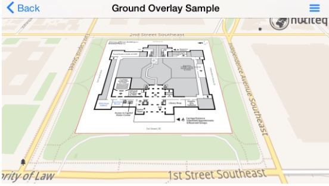

### Ground Overlays

Ground overlays project a bitmap (PNG, JPG) image of a defined coordinate over a basemap. For example, a ground overlay bitmap may be used to show an indoor floorplan over a building map.

**Note:** Your bitmap must define **geographical map coordinates** with `Ground Control Points`. Currently, Mobile SDK supports three or four points on a bitmap image.

#### Ground Overlay Requirements

The following requirements allow you to ground overlays with the Mobile SDK.

- `linear affine transformation` enables you to set three control points to set the location, size, and rotation of the bitmap

- `perspective transformation` enables you to control four control points for the bitmap

-  If you have more control points in your data, it is suggested to choose three or four of your best ones, and select those as your ground control settings

- Control points must be defined in the app code. Mobile SDK does not automatically gather control points from the source file metadata

  For example, if you need GeoTIFF, ESRI World File, MapInfo TAB, Geospatial PDF, or other referenced data, you will get this from the GIS Extension (see below).

- The **entire bitmap must fit to device memory** (RAM). Depending on the target device, the maximum size could vary. For example, the target device maximum size might be 2000x2000 pixels. 

  **Tip:** For larger rasters, the SDK Extensions allow you to display any size bitmap, up to hundreds of megabytes. These bitmaps are read directly from common GIS raster formats (such as GeoTIFF, BSB, ECW, MrSID, JPEG2000, and so on). Additionally, the source data can be entered using different coordinate systems. Please [contact us](mailto:sales@carto.com) if you are interested in enabling SDK Extensions as part of your account.

#### Code Samples

This example uses only one geographical coordinate. The building size is known, and the building direction is facing north. This allows us to calculate other ground points with the code. Four ground control points are set to the corners of the bitmap, which typically returns the most accurate result. 

**Tip:** The following sample code assumes that you have the **jefferson-building-ground-floor.jpg** bitmap file as part of your application project.

- For Android, this image is located under *assets*
- In iOS, it can be located anywhere in your project

   <ul class="tab-navigation">
     <li class="tab-navigationItem">
       <a href="#tab-java">Java</a>
     </li>
     <li class="tab-navigationItem">
       <a href="#tab-csharp">C#</a>
     </li>
     <li class="tab-navigationItem">
       <a href="#tab-objectivec">Objective-C</a>
     </li>
     <li class="tab-navigationItem">
       <a href="#tab-swift">Swift</a>
     </li>
     <li class="tab-navigationItem">
       <a href="#tab-kotlin">Kotlin</a>
     </li>
   </ul>

  

    

    com.carto.graphics.Bitmap overlayBitmap = BitmapUtils.loadBitmapFromAssets("jefferson-building-ground-floor.jpg");

    // 1. Create two vector containing geographical positions and corresponding raster image pixel coordinates
    MapPos pos = proj.fromWgs84(new MapPos(-77.004590, 38.888702));
    double sizeNS = 110, sizeWE = 100;

    MapPosVector mapPoses = new MapPosVector();
    mapPoses.add(new MapPos(pos.getX()-sizeWE, pos.getY()+sizeNS));
    mapPoses.add(new MapPos(pos.getX()+sizeWE, pos.getY()+sizeNS));
    mapPoses.add(new MapPos(pos.getX()+sizeWE, pos.getY()-sizeNS));
    mapPoses.add(new MapPos(pos.getX()-sizeWE, pos.getY()-sizeNS));

    ScreenPosVector bitmapPoses = new ScreenPosVector();
    bitmapPoses.add(new ScreenPos(0, 0));
    bitmapPoses.add(new ScreenPos(0, overlayBitmap.getHeight()));
    bitmapPoses.add(new ScreenPos(overlayBitmap.getWidth(), overlayBitmap.getHeight()));
    bitmapPoses.add(new ScreenPos(overlayBitmap.getWidth(), 0));

    // 2. Create bitmap overlay raster tile data source
    BitmapOverlayRasterTileDataSource rasterDataSource = new BitmapOverlayRasterTileDataSource(0, 20, overlayBitmap, proj, mapPoses, bitmapPoses);
    RasterTileLayer rasterLayer = new RasterTileLayer(rasterDataSource);
    mapView.getLayers().add(rasterLayer);

    // 3. Apply zoom level bias to the raster layer
    // - By default, bitmaps are upsampled on high-DPI screens

    // 4. Correct this by applying appropriate bias
    float zoomLevelBias = (float) (Math.log(mapView.getOptions().getDPI() / 160.0f) / Math.log(2));
    rasterLayer.setZoomLevelBias(zoomLevelBias * 0.75f);
    rasterLayer.setTileSubstitutionPolicy(TileSubstitutionPolicy.TILE_SUBSTITUTION_POLICY_VISIBLE);

    mapView.setFocusPos(pos, 0);
    mapView.setZoom(16f, 0);

    
  

  

    

    var overlayBitmap = BitmapUtils.LoadBitmapFromAssets("jefferson-building-ground-floor.jpg");

    // 1. Create two vector geographical positions, and corresponding raster image pixel coordinates
    var pos = proj.FromWgs84(new MapPos(-77.004590, 38.888702));
    var sizeNS = 110;
    var sizeWE = 100;

    var mapPoses = new MapPosVector();
    mapPoses.Add(new MapPos(pos.X - sizeWE, pos.Y + sizeNS));
    mapPoses.Add(new MapPos(pos.X + sizeWE, pos.Y + sizeNS));
    mapPoses.Add(new MapPos(pos.X + sizeWE, pos.Y - sizeNS));
    mapPoses.Add(new MapPos(pos.X - sizeWE, pos.Y - sizeNS));

    var bitmapPoses = new ScreenPosVector();
    bitmapPoses.Add(new ScreenPos(0, 0));
    bitmapPoses.Add(new ScreenPos(0, overlayBitmap.Height));
    bitmapPoses.Add(new ScreenPos(overlayBitmap.Width, overlayBitmap.Height));
    bitmapPoses.Add(new ScreenPos(overlayBitmap.Width, 0));

    // 2. Create bitmap overlay raster tile data source
    var rasterDataSource = new BitmapOverlayRasterTileDataSource(0, 20, overlayBitmap, proj, mapPoses, bitmapPoses);
    var rasterLayer = new RasterTileLayer(rasterDataSource);
    MapView.Layers.Add(rasterLayer);

    // 3. Apply zoom level bias to the raster layer
    // - By default, bitmaps are upsampled on high-DPI screens

    // 4. Correct this by applying appropriate bias
    float zoomLevelBias = (float)(Math.Log(MapView.Options.DPI / 160.0f) / Math.Log(2));
    rasterLayer.ZoomLevelBias = zoomLevelBias * 0.75f;
    rasterLayer.TileSubstitutionPolicy = TileSubstitutionPolicy.TileSubstitutionPolicyVisible;

    MapView.SetFocusPos(pos, 0);
    MapView.SetZoom(16f, 0);

    
  

  

  

    // 1. Load ground overlay bitmap
    NTBitmap* overlayBitmap = [NTBitmapUtils loadBitmapFromAssets:@"jefferson-building-ground-floor.jpg"];

    // 2. Create two vector geographical positions, and corresponding raster image pixel coordinates
    NTMapPos* pos = [proj fromWgs84:[[NTMapPos alloc] initWithX:-77.004590 y:38.888702]];
    double sizeNS = 110, sizeWE = 100;

    NTMapPosVector* mapPoses = [[NTMapPosVector alloc] init];
    [mapPoses add:[[NTMapPos alloc] initWithX:[pos getX]-sizeWE y:[pos getY]+sizeNS]];
    [mapPoses add:[[NTMapPos alloc] initWithX:[pos getX]+sizeWE y:[pos getY]+sizeNS]];
    [mapPoses add:[[NTMapPos alloc] initWithX:[pos getX]+sizeWE y:[pos getY]-sizeNS]];
    [mapPoses add:[[NTMapPos alloc] initWithX:[pos getX]-sizeWE y:[pos getY]-sizeNS]];

    NTScreenPosVector* bitmapPoses = [[NTScreenPosVector alloc] init];
    [bitmapPoses add:[[NTScreenPos alloc] initWithX:0 y:0]];
    [bitmapPoses add:[[NTScreenPos alloc] initWithX:0 y:[overlayBitmap getHeight]]];
    [bitmapPoses add:[[NTScreenPos alloc] initWithX:[overlayBitmap getWidth] y:[overlayBitmap getHeight]]];
    [bitmapPoses add:[[NTScreenPos alloc] initWithX:[overlayBitmap getWidth] y:0]];

    // 3. Create bitmap overlay raster tile data source
    NTBitmapOverlayRasterTileDataSource* rasterDataSource = [[NTBitmapOverlayRasterTileDataSource alloc] initWithMinZoom:0 maxZoom:20 bitmap:overlayBitmap projection:proj mapPoses:mapPoses bitmapPoses:bitmapPoses];
    NTRasterTileLayer* rasterLayer = [[NTRasterTileLayer alloc] initWithDataSource:rasterDataSource];
    [[mapView getLayers] add:rasterLayer];

    // 4. Apply zoom level bias to the raster layer
    // - By default, bitmaps are upsampled on high-DPI screens

    // 5. Correct this by applying appropriate bias
    float zoomLevelBias = log([[mapView getOptions] getDPI] / 160.0f) / log(2);
    [rasterLayer setZoomLevelBias:zoomLevelBias * 0.75f];
    [rasterLayer setTileSubstitutionPolicy:NT_TILE_SUBSTITUTION_POLICY_VISIBLE];

    [mapView setFocusPos:pos durationSeconds:0];
    [mapView setZoom:16f durationSeconds:0];

    
  

  

    

    let overlayBitmap = NTBitmapUtils.createBitmap(from: UIImage(named: "jefferson-building-ground-floor.jpg"))

    // 1. Create two vector containing geographical positions and corresponding raster image pixel coordinates
    let pos = projection!.fromWgs84(NTMapPos(x: -77.004590, y: 38.888702))!
    let sizeNS = 110.0
    let sizeWE = 100.0

    let mapPoses = NTMapPosVector();
    mapPoses?.add(NTMapPos(x: pos.getX() - sizeWE, y: pos.getY() + sizeNS))
    mapPoses?.add(NTMapPos(x: pos.getX() + sizeWE, y: pos.getY() + sizeNS))
    mapPoses?.add(NTMapPos(x: pos.getX() + sizeWE, y: pos.getY() - sizeNS))
    mapPoses?.add(NTMapPos(x: pos.getX() - sizeWE, y: pos.getY() - sizeNS))

    let bitmapPoses = NTScreenPosVector()
    bitmapPoses?.add(NTScreenPos(x: 0, y: 0))
    bitmapPoses?.add(NTScreenPos(x: 0, y: Float(overlayBitmap!.getHeight())))
    bitmapPoses?.add(NTScreenPos(x: Float(overlayBitmap!.getWidth()), y: Float(overlayBitmap!.getHeight())))
    bitmapPoses?.add(NTScreenPos(x: Float(overlayBitmap!.getWidth()), y: 0))

    // 2. Create bitmap overlay raster tile data source
    let rasterDataSource = NTBitmapOverlayRasterTileDataSource(minZoom: 0, maxZoom: 20, bitmap: overlayBitmap, projection: projection, mapPoses: mapPoses, bitmapPoses: bitmapPoses)
    let rasterLayer = NTRasterTileLayer(dataSource: rasterDataSource);
    mapView?.getLayers()?.add(rasterLayer)

    // 3. Apply zoom level bias to the raster layer
    // - By default, bitmaps are upsampled on high-DPI screens

    // 4. Correct this by applying appropriate bias

    let zoomLevelBias = UIKit.log(mapView!.getOptions().getDPI() / 160.0) / UIKit.log(2.0)
    rasterLayer?.setZoomLevelBias(zoomLevelBias * 0.75)
    rasterLayer?.setTileSubstitutionPolicy(NTTileSubstitutionPolicy.TILE_SUBSTITUTION_POLICY_VISIBLE)

    mapView?.setFocus(pos, durationSeconds: 0)
    mapView?.setZoom(16, durationSeconds: 0)

    
  

  

    
  
    val overlayBitmap = BitmapUtils.loadBitmapFromAssets("jefferson-building-ground-floor.jpg");

    // 1. Create two vector containing geographical positions and corresponding raster image pixel coordinates
    val pos = projection!!.fromWgs84(MapPos(-77.004590, 38.888702))
    val sizeNS = 110
    val sizeWE = 100

    val mapPoses = MapPosVector();
    mapPoses.add(MapPos(pos.x - sizeWE, pos.y + sizeNS))
    mapPoses.add(MapPos(pos.x + sizeWE, pos.y + sizeNS))
    mapPoses.add(MapPos(pos.x + sizeWE, pos.y - sizeNS))
    mapPoses.add(MapPos(pos.x - sizeWE, pos.y - sizeNS))

    val bitmapPoses = ScreenPosVector()
    bitmapPoses.add(ScreenPos(0F, 0F))
    bitmapPoses.add(ScreenPos(0F, overlayBitmap.height.toFloat()))
    bitmapPoses.add(ScreenPos(overlayBitmap.width.toFloat(), overlayBitmap.height.toFloat()))
    bitmapPoses.add(ScreenPos(overlayBitmap.width.toFloat(), 0F))

    // 2. Create bitmap overlay raster tile data source
    val rasterDataSource = BitmapOverlayRasterTileDataSource(0, 20, overlayBitmap, projection, mapPoses, bitmapPoses)
    val rasterLayer = RasterTileLayer(rasterDataSource);
    mapView?.layers?.add(rasterLayer)

    // 3. Apply zoom level bias to the raster layer
    // - By default, bitmaps are upsampled on high-DPI screens

    // 4. Correct this by applying appropriate bias
    val zoomLevelBias = (Math.log(mapView!!.options.dpi / 160.0) / Math.log(2.0)).toFloat()
    rasterLayer.zoomLevelBias = zoomLevelBias * 0.75f
    rasterLayer.tileSubstitutionPolicy = TileSubstitutionPolicy.TILE_SUBSTITUTION_POLICY_VISIBLE

    mapView?.setFocusPos(pos, 0F)
    mapView?.setZoom(16f, 0F)

    
  

    

